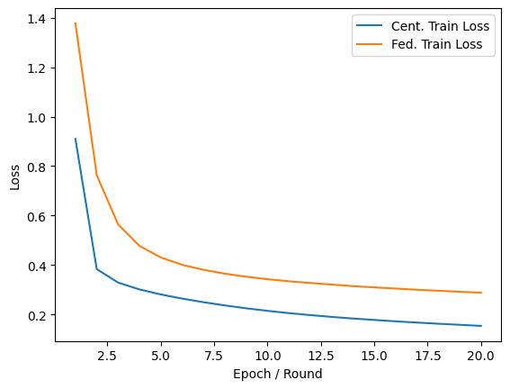
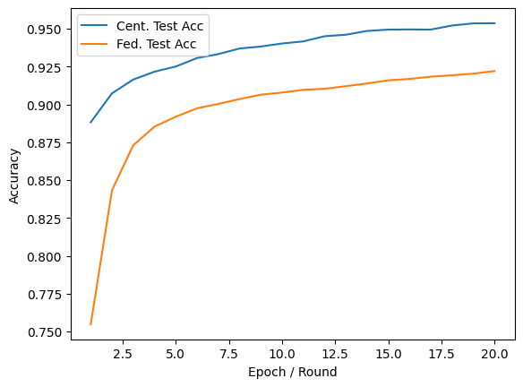
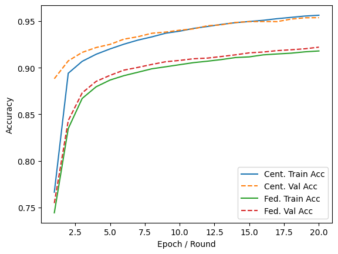
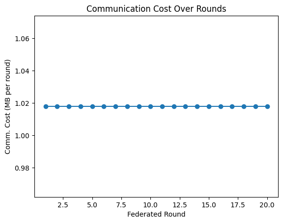

# baseVersion1 : 

## Objective : 
Implement a simple synchronous FL baseline (no differential privacy, no sensing/communication modeling). At the end of this level, user should be able to run multiple “clients” training locally and a central “server” aggregating model weights every fixed number of local epochs.

## Concepts :
<b>Federated Learning basics:</b> client‐server architecture, local updates, global aggregation, partial vs.full participation. 
<b>Synchronous FedAvg algorithm </b> 
<b>PyTorch (or TensorFlow/Keras):</b> building simple neural networks, optimizer loops, loss functions.

## Deliverables :
A minimal FL script (e.g., in PyTorch) that simulates M clients, each with its own local dataset (e.g., a partition of MNIST).

Each client runs A local SGD steps (or epochs) on its local data, then sends its model weights (no noise) to a central aggregator. The server averages the weights and broadcasts the new global model. Repeat for G rounds.

Logging: track train/test accuracy and loss on a held‐out global test set. Plot convergence vs. global round.

## Results : 

    </img>
    </img>

    </img>
    </img>

### Where Federated Learning Shines :

| Property           | Centralized                       | Federated                    |
| ------------------ | --------------------------------- | ---------------------------- |
| **Privacy**        | ✗ raw data sent                   | ✓ no raw data leaves clients |
| **Communication**  | ⇨ raw data (\~47 MB/epoch)        | ⇨ model (\~1 MB/round)     |
| **Scalability**    | server bottleneck with many users | clients train in parallel    |
| **Regulatory Fit** | ✗ may violate data‐sovereignty    | ✓ data remains local         |

#### in sending raw 47 MB MNIST train set per epoch in a naïve centralized “send‐data‐to‐server” scheme

## Author of Blog :
[Deep Patel](https://www.linkedin.com/in/deeppateldw1611/)