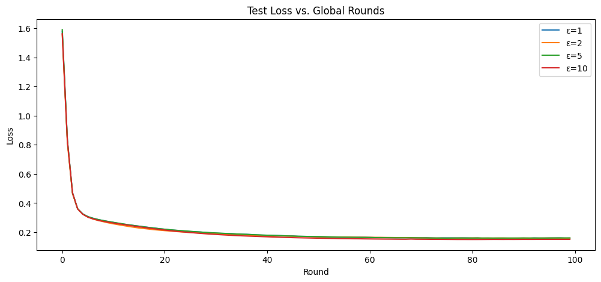
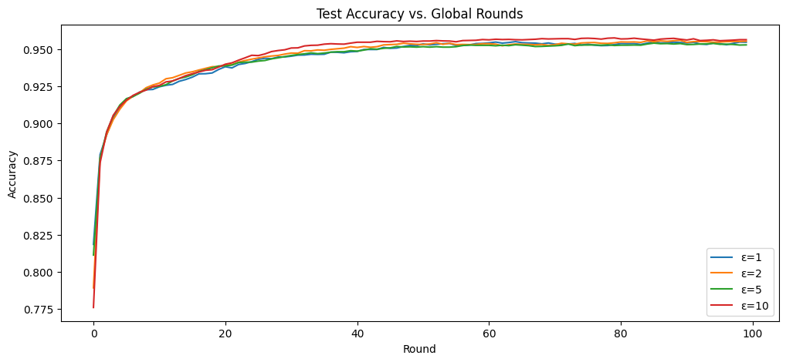
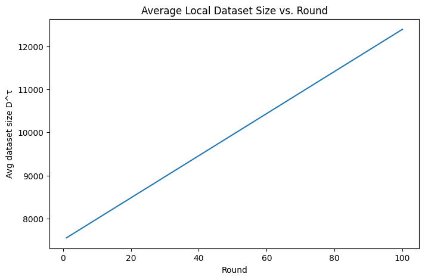

# baseVersion3

This repository implements the ISAC+V2X Federated Learning (FL) simulation, focusing on simulating a simple radar‐sensing process where each client accumulates synthetic data over time and uses it for local training.

## Objective:

- **Simulate radar‐sensing:** Each client generates synthetic data (random Gaussian images + random labels) to mimic ISAC sensing.
- **Model time‐division:** Allocate time between sensing and training per round.
- **Accumulate sensed samples:** Each client’s local dataset grows over time, proportional to its sensing schedule.
- **Integrate with FL:** The growing dataset is used for local training in each round.
- **Track dataset growth:** Plot and confirm that local datasets grow as expected.

---

## Key Concepts:

- **Time-Division Multiplexing (TDM):** Each round, a fraction `aₘ^τ` of time is allocated to sensing. The number of new samples per round is  
  `n_new = floor((aₘ^τ * T_sc) / c_s)`.
- **Synthetic Sensing:** Each new sample is a 28×28 random Gaussian image with a random label (0–9).
- **Local Dataset Growth:** Each client’s dataset grows by `n_new` samples per round.
- **FL Training:** Each client trains on its entire (growing) dataset each round.
- **Differential Privacy:** Local updates are clipped and noised before aggregation.

---

## Note:
For now, ignore SINR, power, modulation, etc. Just treat aₘ^τ as a design choice.In the actual paper, they assume each client “senses” data (via ISAC) and appends this to its local dataset before training. In our simulation, we’ll generate placeholder data (e.g., random noise plus class labels) to mimic that behavior.

## What is implemented:

- [x] **Sensing schedule** is defined (`aₘ^τ = 0.5` for all clients/rounds).
- [x] **Synthetic samples** are generated and appended to each client’s dataset each round.
- [x] **Local training** uses the full (growing) dataset per client.
- [x] **Dataset growth** is tracked and plotted (`Average Local Dataset Size vs. Round`).
- [x] **Growth matches theory:** After 100 rounds, each client has ≈ 5000 new samples (see plot).
- [x] **FL metrics** (loss, accuracy) are plotted vs. global rounds.
- [x] **Code ignores SINR/power/modulation** (as required for Level 3).
- [x] **Plots** included for all required analyses.

---

## Result Plots:

<table>
  <tr>
    <td width="65%" >
      
    </td>
    <td width="55%" valign="top" >
      <b>Test Loss vs. Global Rounds</b> 
       
      <i>This plot shows how the test loss decreases as federated learning progresses over global rounds. Each curve represents a different privacy budget (ε). Lower loss means the model is learning better. Higher ε (less privacy) typically results in lower loss, but weaker privacy guarantees.</i>
    </td>
  </tr>
</table>

 

<table>
  <tr>
    <td width="65%">
      
    </td>
    <td width="55%" valign="top">
      <b>Test Accuracy vs. Global Rounds</b> 
       
      <i>This plot tracks the test accuracy as more rounds are completed and more synthetic sensed data is added to each client. Accuracy improves as the model sees more data. Higher ε values generally yield higher accuracy, reflecting the trade-off between privacy and performance.</i>
    </td>
  </tr>
</table>

 

<table>
  <tr>
    <td width="65%">
      
    </td>
    <td width="55%" valign="top">
      <b>Average Local Dataset Size vs. Round</b> 
       
      <i>This plot demonstrates how each client’s local dataset grows over time as new synthetic samples are “sensed” and added each round. The linear growth confirms that the sensing simulation is working as intended, with each client accumulating more data as training progresses.</i>
    </td>
  </tr>
</table>
  
---

## Author Of Blog:
[Deep Patel](https://www.linkedin.com/in/deeppateldw1611/)

